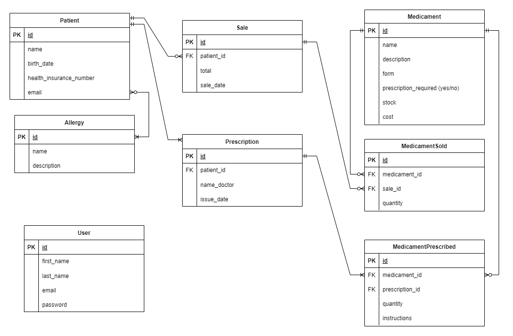
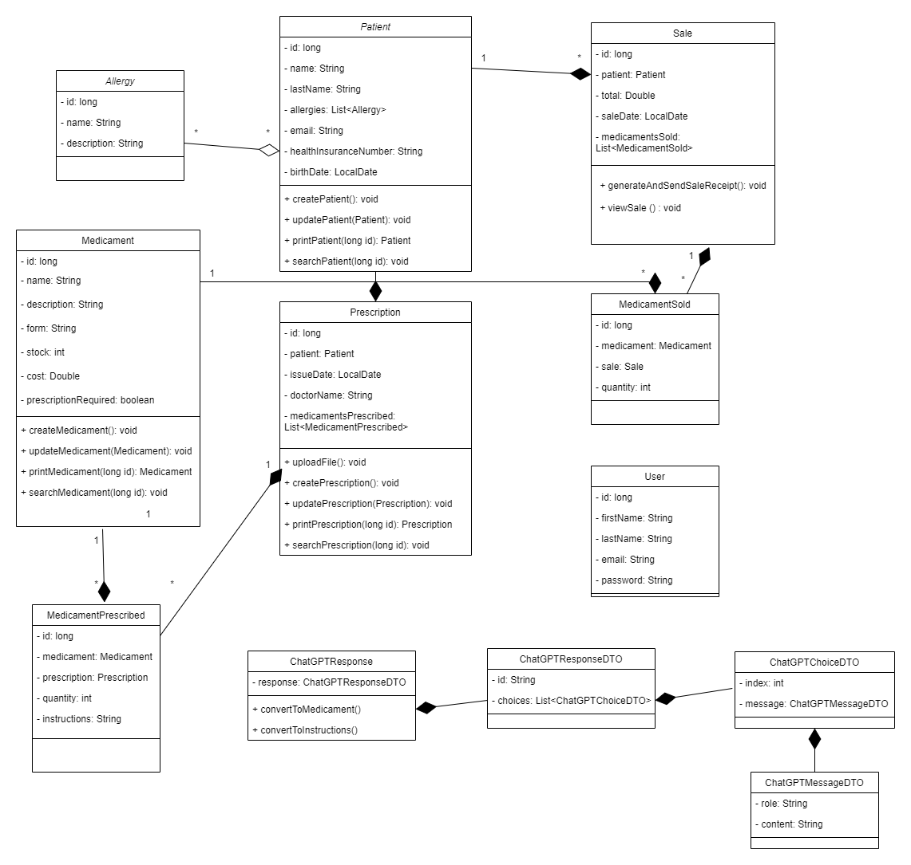
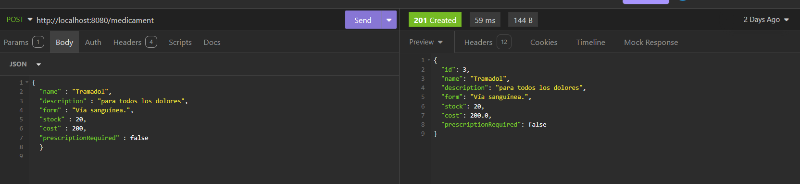
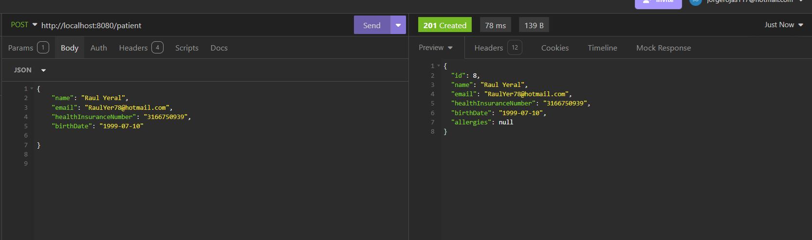
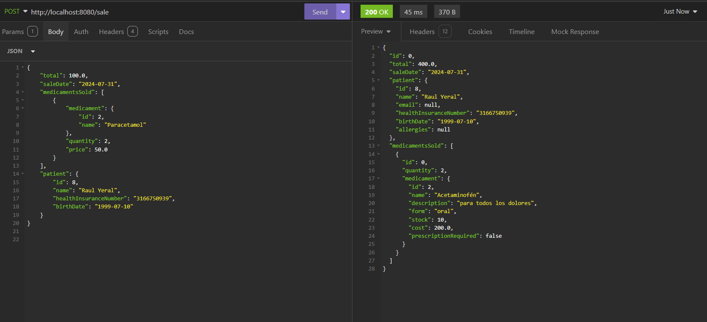

## Proyecto integrador QuickPharma :rocket:

QuickPharma es una aplicación diseñada para optimizar la gestión de recetas médicas, perfiles de pacientes, inventario de medicamentos y ventas. Esta aplicación busca ser altamente segura, escalable y fácil de usar tanto para empleados como para clientes.

La aplicación esta pensanda para actualizar los sistemas de las farmacias tradicionales, la aplicacion usa arquitectura hexagonal, reconocimiento óptico de caracteres (OCR) que es el proceso por el cual se convierte una imagen de texto en un formato de texto que pueden leer las máquinas, se implementa el envio automatico de correos y un anuncio cuando el stock de medicamentos esta bajo.


##  Tecnologias usadas en el proyecto :computer:

### Backend: :hammer_and_wrench:

**Java:** Lenguaje principal para el desarrollo de la lógica de negocio. :coffee:

**Spring Boot:** Framework utilizado para crear servicios web RESTful.:herb:

**Spring Boot Starter Data JPA:** Para la integración con JPA para el manejo de datos. :file_cabinet:

**Spring Boot Starter Web:** Para el desarrollo de aplicaciones web. :globe_with_meridians:

**Spring Boot Starter Security:** Para implementar seguridad en la aplicación. :closed_lock_with_key:

**Spring Boot Starter OAuth2 Resource Server:** Para la implementación de autenticación y autorización con OAuth2.

**Base de Datos:** :card_file_box:

**MySQL:** Sistema de gestión de base de datos utilizado para almacenar la información de la aplicación. :file_cabinet:

**MySQL Connector:** Conector JDBC para MySQL.

**JWT (JSON Web Tokens):**

jjwt-api, jjwt-impl, jjwt-jackson: Bibliotecas para la generación y validación de tokens JWT.

**Correo Electrónico:** :email:

**Mailjet Client:** Para el envío de correos electrónicos a través de Mailjet.

**Generación de Documentos:**

**iText7**: Para la generación de PDFs. :page_facing_up:

**Flying Saucer y OpenPDF:** Herramientas para renderizar y generar documentos PDF. :page_facing_up:

**Apache PDFBox:** Para la manipulación de documentos PDF.

**Mapeo de Objetos:**

**MapStruct:** Para la conversión entre objetos Java.
**Reconocimiento Óptico de Caracteres (OCR)**: :mag:

**Tess4J:** Biblioteca para implementar OCR usando Tesseract con IA. :robot:

**Thymeleaf:** Motor de plantillas para generar vistas dinámicas en el servidor.

**Lombok:** Biblioteca para reducir el código boilerplate en Java. :wrench:

**Testing:**

**JUnit:** Framework de pruebas unitarias. :microscope:

**Spring Boot Starter Test y Spring Security Test:** Para pruebas en la aplicación. :test_tube:

## Frontend
**React:** Biblioteca JavaScript para la construcción de interfaces de usuario. :atom_symbol:

**Chakra UI:** Framework de componentes de interfaz de usuario para React, que proporciona estilos accesibles y consistentes. :art:

## Diagramas usados para la elaboracion del proyecto
## Diagrama Entidad Relación



## Diagrama UML



# Soluciones Propuestas: 💡 - :bulb:

#### Gestión de Pacientes: 👨‍⚕️👩‍⚕️ - :man_health_worker: :woman_health_worker:

- Creación, actualización, visualización y búsqueda de perfiles de pacientes.
- Atributos: ID, Nombre, Fecha de Nacimiento, Alergias, Número de Seguro Médico.
- 
#### Gestión de Medicamentos: 💊 - :pill:

- Creación, actualización, visualización y búsqueda de medicamentos.
- Atributos: ID, Nombre, Forma, Prescripción Requerida, Stock, Costo.
- 
#### Gestión de Recetas Médicas: 📑 - :bookmark_tabs:

Procesamiento de recetas mediante OCR desde archivos de imagen o PDF.
- Atributos: ID de Receta, ID de Paciente, Medicamentos, Cantidades, Instrucciones, Médico, Fecha de Emisión.
- 
#### Gestión de Ventas: 🛒 - :shopping_cart:

- Registro de ventas con detalles completos.
- Generación de boletas de venta en PDF y envío automático al cliente.
- 
#### Problemas Solucionados: ✅ - :white_check_mark:

#### Gestión de Información Compleja: 📊 - :bar_chart:

Análisis detallado de datos médicos y de ventas para ayudar en la toma de decisiones informadas.

#### Procesamiento de Recetas: 📋 - :clipboard:

Uso de tecnología OCR para una conversión precisa de recetas escritas a texto digital, mejorando la eficiencia.

#### Información de Medicamentos: 📚 - :books:

Provisión de descripciones comprensibles y modos de uso de medicamentos para pacientes y profesionales.

#### Experiencia del Cliente: 🏆 - :trophy:

Interfaz de usuario intuitiva que garantiza una experiencia fluida para empleados y clientes, mejorando la satisfacción del cliente.

#### Escalabilidad y Seguridad: 🔒 - :lock:

Arquitectura diseñada para soportar un crecimiento constante con estrictas medidas de seguridad para proteger datos sensibles.

#### Conclusiones: 📈 - :chart_with_upwards_trend:

QuickPharma se presenta como una solución integral para la gestión eficiente de farmacias y la atención al cliente. Al combinar tecnologías avanzadas como el reconocimiento óptico de caracteres (OCR) y la autenticación segura mediante JWT, la aplicación garantiza tanto precisión como protección de datos. Su capacidad para procesar recetas médicas de manera automatizada y proporcionar información detallada sobre medicamentos destaca su utilidad en el entorno médico actual. Además, la interfaz amigable y las funcionalidades avanzadas facilitan una experiencia positiva para los usuarios. Con un diseño escalable y seguro, QuickPharma está preparada para adaptarse al crecimiento y las demandas futuras del mercado.

## 🏁 Comenzando

### Prerrequisitos

Antes de comenzar, asegúrate de tener instalado:

- [Java 17](https://www.oracle.com/java/technologies/javase/jdk17-archive-downloads.html)
- [Maven 3.8.1](https://maven.apache.org/download.cgi)

### Instalación

1. **Clona el repositorio:**

   ```bash
   git clone https://github.com/maurogebe/QuickPharma
   cd QuickPharma
```
## Configura las variables de entorno:

Crea un archivo .env en la raíz del proyecto y define las siguientes variables:
```json

Copiar el código:
-JWT_SECRET=tu_jwt_secreto
-DATABASE_URL=jdbc:postgresql://localhost:3306/quickpharma
-DATABASE_USER=tu_usuario
-DATABASE_PASSWORD=tu_contraseña
```
Construye el proyecto:
```json
bash
Copiar el código
-mvn clean install
```

**Ejecuta la aplicación:**


```json
bash
Copiar código
mvn spring-boot:run
```

###  Despliegue Continuo

Esta aplicación está configurada para el despliegue continuo usando github actions. cada vez que se realiza un push al repositorio, el flujo de trabajo de github actions compila, prueba y despliega automáticamente la aplicación.
H2 Header (Underline)

## Crear Medicamentos



## Crear Pacientes



### Crear Venta




## Links Pagina Desplegada

[Links](https://quickpharma-b8686.web.app/)


## Contribuciones📚

Agradecimientos especiales a todos los colaboradores y mantenedores de este proyecto.

- [Mauricio Guerra](https://github.com/usuario1)
- [Eddie serna](https://github.com/eddieruiz2)
- [Jorge Rojas](https://github.com/usuario2)


## Contacto 📬

Para preguntas o comentarios, puedes contactarme a través de:

- Email: [maurogebe.96@gmail.com]
- LinkedIn: [Mauricio Guerra](https://www.linkedin.com/in/fabian-mauricio-guerra-bedoya)

- Email: [esernaruiz3@gmail.com]
- LinkedIn: [Eddie Serna](https://www.linkedin.com/in/eddie-ruiz-backend)

- Email: [Jorgerojas117@hotmail.com]
- LinkedIn: [Jorge Rojas](https://www.linkedin.com/in/jorgerojas-developer)


## Referencias 🌐

- [Documentación de Spring Boot](https://spring.io/projects/spring-boot)
- [Guía de Tesseract OCR](https://github.com/tesseract-ocr/tesseract)
- [Documentación de JWT](https://jwt.io/introduction)

## Roadmap 🚀

Aquí tienes un vistazo a las mejoras y características mas importantes de la aplicación:

- [ ] Implementación de IA gracias a tesseract y la herramienta (OCR) "Reconocimiento optico de caracteres para leer archivos formato jpg y pdf" .
- [ ] implementado una solución de seguridad robusta utilizando Spring Security y JWT.
- [ ] Envio automaticos de pdf con la información de la venta y actualizacion de stock.
- [ ] Interfaz grafica gracias al uso de React con ChakraUI y CSS .

---

## Agradecimientos

¡Gracias por visitar y usar QuickPharma! Este es el proyecto final del bootcamp de desarrollo Java de la empresa Bitek. 
Estamos agradecidos por el conocimiento y lo aprendido durante todo este tiempo con todo el equipo que estuvo detras, profesores y demas personas 
gracias a los conocimientos adquiridos durante el mismo fue posible la realización de este proyecto, 
nuestra idea es seguir creciendo como profesionales en el sector TI afianzar estos conocimientos y seguir mejorando cada dia enfrentando retos que nos den mas experiencia y habilidades.

## Muchas gracias.
